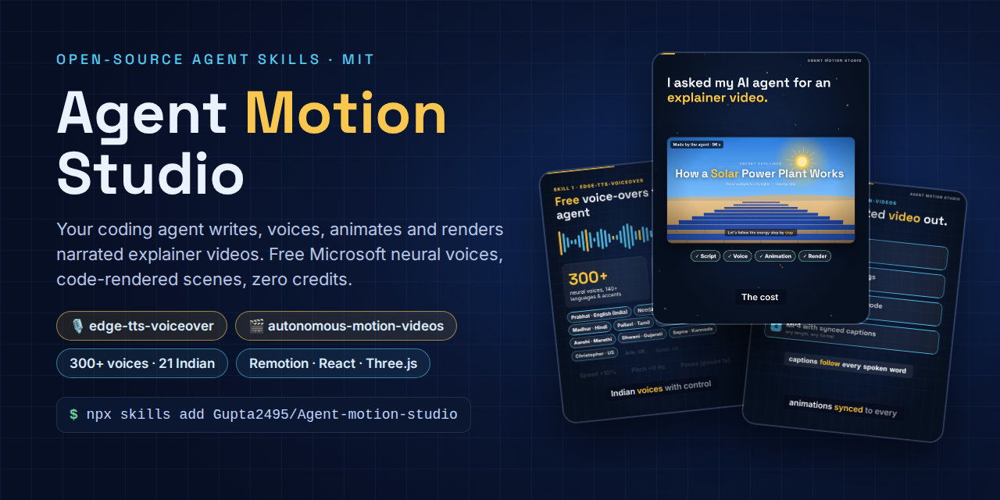

<p align="center">
  
</p>

<p align="center">
  <a href="LICENSE"></a>
  <a href="#install"></a>
  <a href="https://skills.sh"></a>
  
  
</p>

<p align="center">
  <b>Free AI voice-overs and narrated explainer videos, generated by your coding agent.</b><br>
  Script → neural voice-over → code-rendered animation → MP4. No credits, no watermark, no 8-second clip limit.
</p>

<p align="center">
  <a href="#quick-start">Quick start</a> ·
  <a href="#see-it">Demo</a> ·
  <a href="#install">Install</a> ·
  <a href="#commands-claude-code">Commands</a> ·
  <a href="#how-it-works">How it works</a> ·
  <a href="#honest-limits">Limits</a>
</p>

## Quick start

```bash
npx skills add Gupta2495/Agent-motion-studio
```

Then ask your agent:

> *"Make a 60-second explainer on how solar power plants work, Indian English voice, 16:9."*

## What's inside

| Plugin / skill | What it does |
|---|---|
| **[`edge-tts-voiceover`](plugins/edge-tts-voiceover)** | Voice-overs with **Microsoft neural voices**, free with no API key. 300+ voices, including **21 Indian voices in 10 languages**. Asks for voice profile, speed, pitch and script. Delivery tags: `[pause 1s]` `[excited]` `[calm]` `[sad]` `[nervous]`. Outputs MP3 + SRT + word timings. |
| **[`autonomous-motion-videos`](plugins/autonomous-motion-videos)** | Narrated explainer videos of **any length**, rendered from code (Remotion + React + SVG), with optional **Three.js 3D** and **AI images** made through your browser. Captions and animations land on the exact spoken word. Includes a `script.json`-driven starter template and a full 96 s reference build. |

Both follow the open **SKILL.md** standard, so they work in Claude Code, Codex CLI, Gemini CLI, Antigravity, Cursor and other agents that read skills.

## See it

<p align="center">
  <a href="samples/agent-motion-studio-promo.mp4"></a><br>
  <sub>This 79-second promo was scripted, voiced, animated and rendered by the skills. <a href="samples/agent-motion-studio-promo.mp4">Watch the full MP4 with sound</a>.</sub>
</p>

| | |
|---|---|
| [](samples/solar-explainer-contact-sheet.png) | [](samples/water-cycle-contact-sheet.png) |
| **Solar power plant explainer:** 96 s, 8 custom scenes, built in ~15 min, rendered in ~6 min on 2 CPUs | **Starter template:** 49 s, generated straight from `script.json` ([watch the MP4](samples/water-cycle-template-render.mp4)) |

**Voice demos:**
[Indian English (Prabhat)](samples/voice-demo-indian-english-prabhat.mp3) ·
[US English (Christopher)](samples/voice-demo-us-christopher.mp3) ·
[delivery tags: calm → excited → nervous → sad → serious](samples/voice-demo-emotion-tags.mp3)

## Install

**Claude Code (plugin marketplace):**
```
/plugin marketplace add Gupta2495/Agent-motion-studio
/plugin install autonomous-motion-videos@agent-motion-studio
/plugin install edge-tts-voiceover@agent-motion-studio
```

**Any agent (Codex, Gemini CLI, Cursor, Antigravity, Claude Code…) via [skills.sh](https://skills.sh):**
```bash
npx skills add Gupta2495/Agent-motion-studio                     # both skills
npx skills add Gupta2495/Agent-motion-studio --skill edge-tts-voiceover
```

**Claude.ai / Claude desktop (Cowork):** download [`dist/autonomous-motion-videos.zip`](dist/autonomous-motion-videos.zip) and/or [`dist/edge-tts-voiceover.zip`](dist/edge-tts-voiceover.zip), then upload them in **Settings → Capabilities → Skills**.

<details>
<summary><b>Manual install</b> (copy the skill folder)</summary>

copy `plugins/<name>/skills/<name>/` into your agent's skills folder:

| Agent | Folder |
|---|---|
| Claude Code | `~/.claude/skills/` |
| Codex CLI | `~/.agents/skills/` |
| Gemini CLI | `~/.gemini/skills/` |
| Antigravity | `~/.gemini/antigravity/skills/` |
| Cursor | `~/.cursor/skills/` |

</details>

**Requirements:** Python 3 + `pip install edge-tts`, ffmpeg, and Node 18+ for videos.

## Commands (Claude Code)

| Command | What it does |
|---|---|
| `/edge-tts-voiceover:voiceover [script or file]` | Asks for voice / speed / pitch, then generates `voiceover.mp3` + `.srt` |
| `/edge-tts-voiceover:voices [en-IN \| hi \| en-US …]` | Lists voices for a language or accent |
| `/autonomous-motion-videos:explainer-video [topic]` | Full pipeline: script → narration → scenes → preview → MP4 |
| `/autonomous-motion-videos:new-video-project [folder]` | Scaffolds the ready-to-render template |

The skills also trigger on their own when you ask naturally, for example:
- "make a Hindi voice-over of this, female, slightly fast"
- "create a 9:16 explainer on UPI payments"

## How it works

```
script (scenes) ─► Microsoft neural TTS (edge-tts) ─► per-scene MP3 + word timings ─► timeline.json
                                                                                        │
          React/SVG (+ Three.js / AI images) scenes read the timeline ◄─────────────────┘
                                   │
          Remotion renders every frame ─► captions + animations fire on the exact spoken word ─► MP4
```

The voice comes first, and scene lengths come from the narration. So changing the script, voice, language or speed re-times the whole video automatically.

**Interactive vs autonomous:**
- Interactively, the video skill asks about topic, length, format, voice, speed, pitch and visual route: pure code, 3D, AI images, or AI video B-roll.
- Unattended, it picks the route from what the agent can do (browser control, image APIs, headless WebGL). It never spends paid credits or signs in to anything on its own.

## Honest limits

- **Emotions:** the free endpoint takes plain text only, with no SSML or speaking styles. Pauses and tone shifts work through speed, pitch and volume changes per segment. Real laughing, sighing or whispering don't; supply sound files for `[laugh]` / `[sigh]` via `--sfx-dir`.
- **Voices:** a voice can occasionally stop responding (seen with en-US Andrew). Pick another voice of the same profile.
- **Endpoint:** edge-tts uses Microsoft's free Edge read-aloud endpoint, which is unofficial. `pip install -U edge-tts` if it ever breaks.
- **Remotion licence:** Remotion is free for individuals and small teams (companies of up to 3 people); larger companies need a Remotion company licence. See [remotion.dev/license](https://www.remotion.dev/license). This repo's own code is MIT.
- **Look:** pure code gives a clean infographic style. For realism, add 3D models or AI-image backgrounds; both are covered in the skill.

## Repository layout

```
.claude-plugin/marketplace.json          # Claude Code marketplace: agent-motion-studio
plugins/
  edge-tts-voiceover/
    .claude-plugin/plugin.json
    commands/  voiceover.md, voices.md
    skills/edge-tts-voiceover/           # SKILL.md, scripts/voiceover.py, examples/
  autonomous-motion-videos/
    .claude-plugin/plugin.json
    commands/  explainer-video.md, new-video-project.md
    skills/autonomous-motion-videos/     # SKILL.md, scripts/, template/, examples/solar-explainer/
dist/                                    # skill zips for Claude.ai upload
assets/                                  # banner + demo GIF used in this README
samples/                                 # demo audio, renders, contact sheets, promo video
```

## Credits

Built by **[Nikhilesh Gupta](https://github.com/Gupta2495)** with Claude.

Powered by:
- [edge-tts](https://github.com/rany2/edge-tts)
- [Remotion](https://www.remotion.dev)
- [Three.js](https://threejs.org)
- [Inter](https://rsms.me/inter/) & [Space Grotesk](https://fonts.google.com/specimen/Space+Grotesk) fonts (OFL)

MIT licensed. See [LICENSE](LICENSE).
